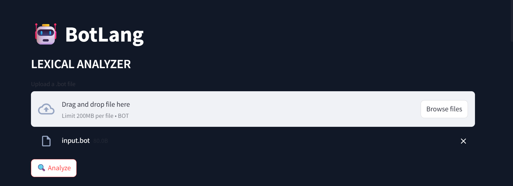
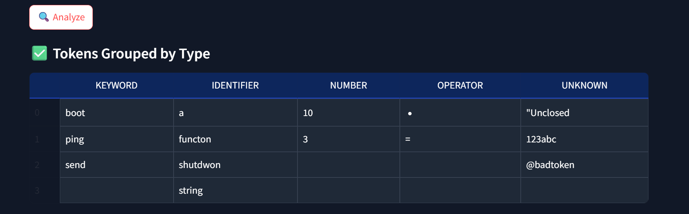
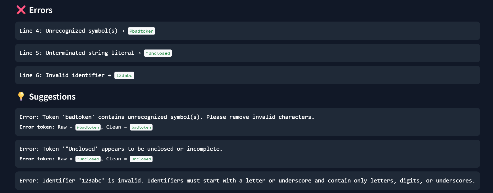
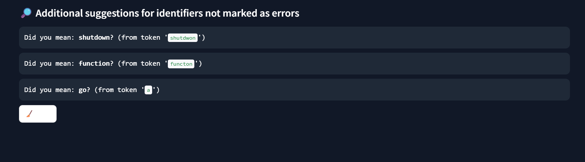

# 🤖 BotLang | Lexical Analyzer for Custom Language

*BotLang* is a lexical analyzer tailored specifically for the custom programming language *BotLang*. It allows users to upload .bot files, tokenize the content in real time, detect lexical errors, and intelligently suggest corrections using *Levenshtein distance*. Built for learning, debugging, and developing your own language.

---

## 🧠 What is BotLang?

BotLang is a domain-specific programming language created for educational and experimental purposes. The language includes custom keywords, operators, and syntax. This analyzer helps validate and interpret .bot files by breaking them into tokens and checking for lexical consistency.

---

## ✨ Key Features

- *📥 Upload & Analyze*  
  Upload .bot source files (up to 200MB) via drag-and-drop or file browser and tokenize them live.

- *🧠 Custom Lexical Analyzer*  
  Designed specifically for the BotLang language with support for:
  - Keywords like boot, ping, shutdown, function
  - Numbers, Identifiers, Operators

- *⚠ Lexical Error Detection*  
  Detects:
  - Unrecognized symbols (e.g. @, $)
  - Unterminated string literals
  - Invalid identifiers (e.g. starting with a digit)

- *💡 Keyword Suggestions (Levenshtein-Based)*  
  Misspelled identifiers or keywords are auto-suggested using *Levenshtein distance*, helping correct typos like:
  
  Did you mean 'function'? (from token 'functon')
  

- *📊 Grouped Token Display*  
  Tokens are visually grouped by:
  - Keyword
  - Identifier
  - Number
  - Operator
  - Delimiters
  - Unknown (with error markers)

- *✅ Clean UI with Streamlit*  
  Easy-to-use interface for uploading, analyzing, and reviewing errors.

---

## 🖼 Screenshots

### Upload & Analyze .bot File

### Token Grouping Output

### Error Detection & Suggestions

### Levenstein Suggestions

---

## 🏫 Who Is This For?

- Students building or analyzing custom compilers  
- Educators teaching lexical analysis concepts  
- Developers working on DSLs (domain-specific languages)  
- Hackathon teams designing experimental language tools

---

## 🛠 Tech Stack

- *Python 3.7+*
- *Streamlit* – UI framework  

---

## 🚀 Getting Started

### 1. Clone the Repository

bash
git clone https://github.com/your-username/botlang-lexical-analyzer.git
cd botlang-lexical-analyzer

python -m venv venv

# Activate Virtual Environment
# Windows
venv\Scripts\activate
# macOS/Linux
source venv/bin/activate

streamlit run frontend.py

---

## 🔍 How It Works

### 📁 Upload .bot File
- Select or drag a .bot source file.
- The analyzer reads it line-by-line and performs lexical analysis.

### 🧠 Tokenization
- The analyzer uses regex rules to split input into:
  - Keywords
  - Identifiers
  - Operators
  - Numbers
  - Delimiters
  - Unknown symbols

### ❌ Error Detection
Common issues:
- @badtoken → *Unrecognized symbol*
- "Unclosed → *Unterminated string*
- 123abc → *Invalid identifier*

### 💡 Suggestion Engine
- Misspelled keywords are matched with Levenshtein distance logic

---

## 📁 Project Structure

botlang-lexical-analyzer/
├── frontend.py                    # Streamlit frontend
├── lexical.py                     # Core lexical analyzer logic
├── levenstein_distance.py         # Levenshtein-based keyword suggestion
├── error_handler.py               # error detection
├── input.bot                      # Example code file
├── BotLang_Description.txt        # Botlang Language description
├── README.md                      # Project documentation
├── screenshots/                   # Images used in README

---

## 🔮 Future Enhancements

- Syntax highlighting for .bot source preview  
- Export results as JSON or CSV  
- Integration with syntax parser for full compiler pipeline  
- Real-time code editor for writing .bot scripts in browser  

---

## 🤝 Contributions

Contributions are welcome!

1. Fork the repository  
2. Create a new branch (feature/your-feature)  
3. Make your changes  
4. Push to your branch and open a PR

---

## 👩‍💻 Authors

- Divyanshi Rasotia  
- Shambhavee Shukla
- Khushi Kumari Jha
- Bhawna Bisht

---
